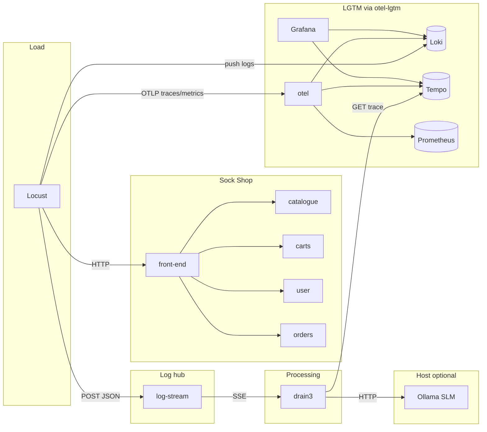

# Socks observability & anomaly pipeline — documentation

This repository extends the **Weaveworks Sock Shop** demo with a **real-time log streaming hub**, an **LSTM-based processor (drain3)** that can call **Grafana Tempo** and a **small language model (SLM)**, **Locust** load tests with OTLP/Loki export, and an **offline training / EDA** package under `offline_lstm/`.

---

## 1. High-level architecture



**Data paths**

| Path | Mechanism | Purpose |
|------|-----------|---------|
| Locust → Sock Shop | HTTP | Synthetic user traffic |
| Locust → Loki | `POST /loki/api/v1/push` | Historical / batch log search in Grafana |
| Locust → OpenTelemetry | OTLP HTTP `:4318` | Traces and metrics in Tempo / Prometheus |
| Locust → log-stream | `POST /v1/logs` | Real-time JSON fan-out |
| drain3 ← log-stream | `GET /v1/stream` (SSE) | Live log consumption |
| drain3 → Tempo | `GET /api/traces/{trace_id}` | Trace digest for SLM context |
| drain3 → SLM | e.g. Ollama `POST .../api/generate` | Natural-language triage |

---

## 2. Docker Compose services

| Service | Image / build | Host ports | Role |
|---------|---------------|------------|------|
| `front-end`, `catalogue`, `carts`, `user`, `orders`, `payment`, `shipping` | Weaveworks demos | `8079` (UI) | Demo e-commerce |
| `rabbitmq`, `queue-master` | — | (internal) | Async order pipeline |
| `otel` | `grafana/otel-lgtm:latest` | `3000` Grafana, `3100` Loki, `3200` Tempo, `4317/4318` OTLP, `9090` Prometheus | All-in-one observability |
| `locust` | `./locust` | `8089` | Load generator; pushes to Loki + OTLP + log-stream when `LOG_STREAM_URL` is set |
| `log-stream` | `./log-stream` | `8090` → container `8080` | Ingest + SSE broadcast |
| `drain3` | `./drain3` | (none) | Stream consumer, LSTM + rules, Tempo + SLM |

**Bring everything up**

```bash
docker compose up -d
```

Do **not** use `…` as a service name; either `docker compose up -d` for all services or list real names explicitly.

---

## 3. log-stream (`./log-stream`)

- **Stack:** FastAPI + Uvicorn.
- **`POST /v1/logs`** — JSON body (any object). Returns `204`; broadcasts to all SSE clients.
- **`GET /v1/stream`** — `text/event-stream`: one `data: <json>` line per event; `: keepalive N` comments every 15s if idle.
- **`GET /health`** — `status`, `subscribers`, `ingests_total`.

**Environment**

| Variable | Default | Meaning |
|----------|---------|---------|
| `SSE_QUEUE_MAX` | `256` | Max queued events per slow client before drop |

---

## 4. drain3 (`./drain3`)

### 4.1 Behaviour

1. Connects to **`LOG_STREAM_URL`** (SSE).
2. Parses each `data:` line as JSON into the same shape Locust sends: `message`, `level`, `labels` (method, url, status, duration_ms, trace_id), optional top-level `trace_id`.
3. Maps each event to an **8-D feature vector** (aligned with `offline_lstm/features.py`).
4. Maintains a sliding window (default length **24**). **Input to LSTM:** first **23** steps; **target:** step **24** (next-vector prediction).
5. **Rule path (default on):** `level == error` or HTTP **5xx** → treat as anomaly immediately (`DRAIN3_FORCE_RULES=0` disables).
6. **Model path:** mean squared error between prediction and actual next vector; after **warmup** MSE samples, compares to a rolling threshold (high quantile + Z × std).
7. On anomaly: fetches **Tempo** trace (if `trace_id` present), builds a text digest, sends prompt to **SLM** (Ollama-compatible API), logs result at **WARNING**.

### 4.2 Training modes

- **Default (no checkpoint):** `bootstrap_train` runs **200** steps on **synthetic Gaussian** sequences so errors are not arbitrary at cold start. **No learning from your real logs** in this phase.
- **With checkpoint:** set **`DRAIN3_CHECKPOINT`** to a file produced by `offline_lstm/train.py` (`lstm_best.pt`). Weights load; bootstrap is skipped. **`WINDOW` / `FEAT_DIM` must match** training; checkpoint may log a warning if `window` differs.

### 4.3 Environment variables

| Variable | Required | Default | Meaning |
|----------|----------|---------|---------|
| `LOG_STREAM_URL` | yes | — | SSE URL, e.g. `http://log-stream:8080/v1/stream` |
| `TEMPO_URL` | no | `http://otel:3200` | Tempo query base (no path suffix) |
| `SLM_URL` | no | empty | e.g. `http://host.docker.internal:11434/api/generate` |
| `SLM_MODEL` | no | `llama3.2` | Ollama model name |
| `DRAIN3_WINDOW` | no | `24` | Window length (must match offline training if using checkpoint) |
| `DRAIN3_FEAT_DIM` | no | `8` | Feature size |
| `DRAIN3_WARMUP` | no | `64` | Minimum MSE samples before model-based alerts |
| `DRAIN3_ERROR_RING` | no | `400` | Rolling buffer size for MSE statistics |
| `DRAIN3_Z` | no | `4.5` | Z multiplier for threshold |
| `DRAIN3_FORCE_RULES` | no | `1` | `1` = rule anomalies fire before model |
| `DRAIN3_CHECKPOINT` | no | empty | Path to `lstm_best.pt` inside container |
| `LOG_LEVEL` | no | `INFO` | Python logging level |

**Host Ollama from Docker:** `extra_hosts: host.docker.internal:host-gateway` is set on `drain3` for Linux-friendly host access; on Docker Desktop for Mac it also works.

### 4.4 Stable URL feature

URL bucketing uses **MD5** (first 8 hex chars), not Python’s `hash()`, so **offline training and live drain3 agree** on features.

---

## 5. Locust (`./locust`)

- Sends **traces** and **metrics** via OTLP to `otel:4318`.
- Sends **logs** to Loki at `otel:3100`.
- If **`LOG_STREAM_URL`** is set (Compose sets it), each completed request also **POSTs** a JSON log line to log-stream, including **`trace_id`** when the current OpenTelemetry span is valid.

---

## 6. offline_lstm — historical data, EDA, train / val / test

Runs **on the host** (or CI) with a virtualenv; not part of the Compose stack by default.

### 6.1 Layout

| Path | Description |
|------|-------------|
| `config.py` | Paths, `WINDOW`, `FEAT_DIM`, Loki URL, split fractions, training hyperparameters |
| `features.py` | Feature extraction (must match drain3) |
| `model.py` | `LSTMPredictor` |
| `fetch_loki.py` | Loki `query_range` → `data/raw_logs.csv` or `--demo` synthetic data |
| `prepare_data.py` | `features.csv`, `windows.npz`, `splits.json`; **chronological** 70% / 15% / 15% split on **windows** |
| `eda.py` | Plots under `plots/eda_*.png` |
| `train.py` | Supervised training; `checkpoints/lstm_best.pt`, `plots/train_val_loss.png` |
| `validate.py` | Val metrics + `validate_report.json`, scatter, error histogram |
| `test.py` | Test metrics + `test_report.json`, per-dimension MSE bar chart |
| `requirements.txt` | Python dependencies |

### 6.2 Typical command sequence

```bash
cd offline_lstm
python3 -m venv .venv && source .venv/bin/activate
pip install -r requirements.txt

# Option A — real Loki (stack running, port 3100 on host)
export LOKI_URL=http://localhost:3100
python fetch_loki.py --minutes 120 --query '{service_name="locust"}'

# Option B — no Loki
python fetch_loki.py --demo

python prepare_data.py
python eda.py
python train.py
python validate.py
python test.py
```

### 6.3 Git ignore / artifacts

Root `.gitignore` excludes generated `offline_lstm/data/*` (except `.gitkeep`), `offline_lstm/plots/`, `offline_lstm/checkpoints/`, and `offline_lstm/.venv/`. Regenerate locally or in CI.

### 6.4 Using trained weights in drain3

1. Train and copy `offline_lstm/checkpoints/lstm_best.pt` to a path visible inside the container.
2. Mount the file (volume) and set `DRAIN3_CHECKPOINT` to that path.
3. Keep **`DRAIN3_WINDOW`** equal to the `window` recorded in `data/splits.json` / training config.

---

## 7. Ports quick reference

| Port | Service |
|------|---------|
| 8079 | Sock Shop UI |
| 8089 | Locust |
| 8090 | log-stream (mapped to 8080 in container) |
| 3000 | Grafana |
| 3100 | Loki |
| 3200 | Tempo |
| 4317 / 4318 | OTLP |
| 9090 | Prometheus |

---

## 8. What is implemented (summary)

- [x] Sock Shop + LGTM (`otel-lgtm`) in Compose  
- [x] Locust with OTLP traces/metrics + Loki logs + optional real-time POST to log-stream  
- [x] log-stream ingest + SSE + health / ingest counter  
- [x] drain3: LSTM next-step predictor, rule + model anomalies, Tempo fetch + trace summary, Ollama-style SLM call  
- [x] Logging improvements for drain3 (stderr, startup banner, reconnect errors)  
- [x] Optional **`DRAIN3_CHECKPOINT`** for offline-trained weights  
- [x] **`offline_lstm`**: Loki fetch, CSV storage, feature CSV, windowed dataset, chronological splits, EDA plots, train / validate / test scripts and result plots + JSON reports  
- [x] Stable URL hashing shared between drain3 and offline pipeline  
- [x] `.gitignore` cleanup and ignores for generated offline artifacts  

---

## 9. What is not done / recommended next steps

These are **not** implemented; treat as a backlog for a production or extended hackathon follow-up.

### 9.1 Reliability & scale

- [ ] **Durable queue** (Kafka, NATS, Redis Streams) instead of in-memory SSE fan-out for multi-replica drain3 and replay.  
- [ ] **Back-pressure** policy documentation and client retries for `POST /v1/logs`.  
- [ ] **Health checks** in Compose (`healthcheck`) for log-stream and drain3.  
- [ ] **Rate limiting** and **authentication** on log-stream ingest and optionally on SSE.

### 9.2 ML / detection

- [ ] **Labelled anomalies** for precision/recall (today: unsupervised MSE + rules).  
- [ ] **Periodic or online retraining** job from Loki/object storage.  
- [ ] **Hyperparameter search** and saved experiment config (MLflow, etc.).  
- [ ] **Calibration** of `DRAIN3_WARMUP`, `DRAIN3_Z`, and window length from validation curves.  
- [ ] **Export metrics** from drain3 (Prometheus/OpenTelemetry) for monitoring the pipeline itself.

### 9.3 drain3 / SLM

- [ ] **Non-Ollama** APIs (OpenAI-compatible, local vLLM) behind a small adapter.  
- [ ] **Deduplication** or **cooldown** for repeated identical anomalies (reduces SLM spam).  
- [ ] **Outbound webhooks** (Slack, PagerDuty) in addition to logs.

### 9.4 Tracing

- [ ] **Guaranteed trace_id on Locust logs** (context may be cleared before Locust’s `on_request` hook; consider explicit span per request or W3C propagation from responses).  
- [ ] **TraceQL** batch jobs feeding the same summarizer used in drain3.

### 9.5 offline_lstm

- [ ] **Automated tests** (pytest) for `features.py` parity with drain3.  
- [ ] **CI workflow** that runs `--demo` pipeline on push.  
- [ ] **Larger Loki pagination** / deduplication if queries exceed limits.  
- [ ] **Optional commit** of small **sample CSV** for demos (currently gitignored).

### 9.6 Documentation & ops

- [ ] **Single top-level README** with a 5-minute quickstart (this file is the deep dive).  
- [ ] **Version pins** for all Python dependencies in drain3/log-stream Docker images.  
- [ ] **Terraform / Helm** or cloud-specific deployment notes (if targeting beyond local Compose).

---

## 10. Troubleshooting

| Symptom | Likely cause | What to check |
|---------|----------------|---------------|
| SSE only `: keepalive`, no `data:` | Nothing POSTing to log-stream | `curl localhost:8090/health` → `ingests_total`; Locust `printenv LOG_STREAM_URL` inside container; Locust logs for “Streaming request logs to …” |
| drain3 logs empty at first | Torch import + bootstrap | Wait 10–60s; look for stderr “drain3: starting…” |
| SLM errors | Ollama not running / wrong model | `curl localhost:11434/api/tags`; match `SLM_MODEL` |
| Tempo 404 for trace | Missing or wrong `trace_id` | Logs may not carry trace id from Locust; still get log-only SLM prompt |
| Offline vs live mismatch | Window / features | Same `WINDOW`, `FEAT_DIM`, and MD5 URL bucket (already aligned in code) |

---

## 11. File map (custom code)

```
socks/
├── docker-compose.yaml
├── DOCUMENTATION.md          ← this file
├── log-stream/               # SSE hub
├── drain3/                   # Stream processor + LSTM + Tempo + SLM
├── locust/                   # Load test + telemetry
└── offline_lstm/             # Loki → CSV → EDA → train/val/test
```

---

*Last updated to match the repository layout and behaviour as of the documentation authoring pass.*
